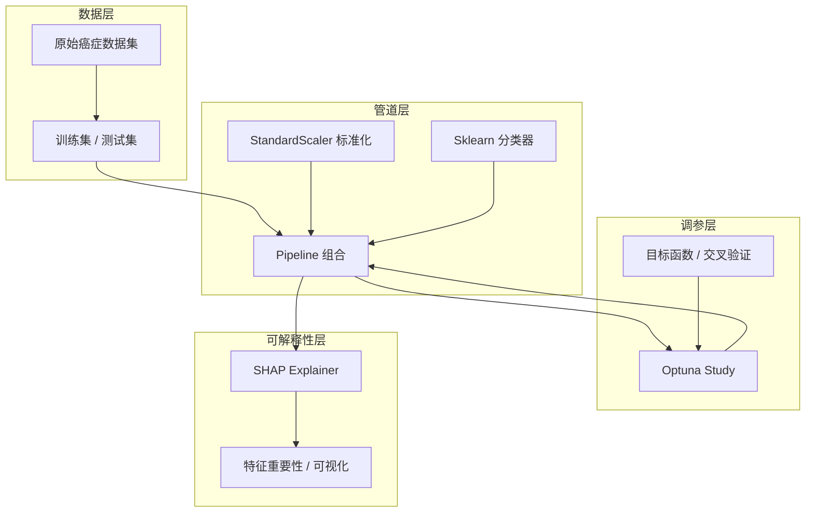
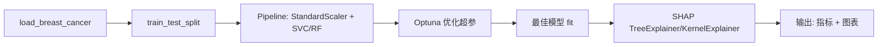

# 癌症数据集分类预测 - 项目设计文档

## 1. 系统架构

## 2. 数据流与管道设计

- **数据源**：`sklearn.datasets.load_breast_cancer`（威斯康星乳腺癌二分类，30 维特征）。
- **标准化**：管道内使用 `StandardScaler`，仅对训练集 fit，测试集与 SHAP 共用同一缩放。
- **管道**：`StandardScaler` + 可配置分类器（默认 SVC，可选 RandomForest 等），便于扩展。
- **调参**：Optuna 对管道内模型超参数进行搜索，目标为交叉验证得分（如 accuracy 或 f1）。
- **可解释性**：对训练后的最佳管道模型使用 SHAP（TreeExplainer 用于树模型，KernelExplainer 用于 SVC 等）生成特征贡献与图表。

## 3. 模块与接口清单

| 模块 | 路径 | 职责 |
|------|------|------|
| 数据加载 | `backend/src/data/load_data.py` | 加载癌症数据集、划分训练/测试、返回 X_train, X_test, y_train, y_test, feature_names |
| 管道定义 | `backend/src/pipeline/model_pipeline.py` | 构建 `Pipeline(StandardScaler, Classifier)`，提供 `create_pipeline(clf_name, **params)` |
| Optuna 调参 | `backend/src/tuning/optuna_tune.py` | `run_study(X, y, pipeline_factory, n_trials)` 返回 best_params 与 study |
| SHAP 解释 | `backend/src/interpretation/shap_explain.py` | `explain_model(pipe, X, feature_names)`，输出摘要图与条形图、数值结果 |
| 主入口 | `backend/main.py` | 串联：加载数据 → 调参 → 训练最佳模型 → 评估 → SHAP 解释并保存结果 |

**无 REST API**：本项目为离线 Python 脚本/服务，通过命令行或 Docker 运行，输出为控制台日志与 `output/` 下图表及指标文件。

## 4. 技术栈与依赖

- **Python**: 3.10+
- **核心库**: scikit-learn, optuna, shap
- **辅助**: pandas, numpy
- **可视化**: matplotlib（SHAP 内置依赖）

## 5. 运行与产出

- **本地**：`cd backend && pip install -r requirements.txt && python main.py`
- **Docker**：根目录 `docker-compose up --build -d`，backend 服务执行 `main.py`，结果写入容器内 `output/`（可挂载到宿主机）。
- **产出物**：最佳超参、测试集指标（accuracy/f1 等）、SHAP 摘要图与特征重要性图、简要文本报告。

## 6. 扩展性说明

- 分类器与超参空间均在配置/工厂中维护，新增算法只需扩展 `model_pipeline` 与 Optuna 的 suggest 逻辑。
- 数据集可替换为其他癌症相关 CSV/API，只需实现与 `load_data` 相同签名的接口（返回 X_train, X_test, y_train, y_test, feature_names）。
